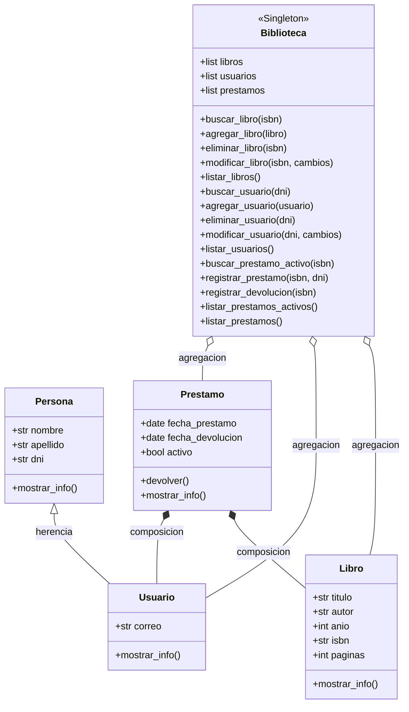

# Grupo-24-PA

[](https://github.com/francocinallidev11/Grupo-24-PA/actions/workflows/tests.yml)

## Trabajo Práctico Integrador Final

Sistema de Gestión de Biblioteca Digital desarrollado en Python para la materia Programación Avanzada.

## Integrantes

* Alejo Hernandez
* Franco Cinalli
* Tomás Ferrufino
* Ariel Dinocco

## Descripción

El proyecto consiste en el desarrollo de un sistema para administrar una biblioteca digital utilizando Programación Orientada a Objetos (POO).

El sistema permitirá:

* Gestión de libros.
* Gestión de usuarios.
* Registro de préstamos y devoluciones.
* Consulta de préstamos activos.

## Conceptos Aplicados

* Encapsulamiento
* Herencia
* Polimorfismo
* Agregación
* Composición
* Decoradores
* Metaclases
* Patrón de Diseño Singleton

## Estructura del Proyecto

```text
Grupo-24-PA/
│
├── modelos/
│   ├── libro.py
│   ├── persona.py
│   ├── usuario.py
│   └── prestamo.py
│
├── sistema/
│   └── biblioteca.py
│
├── utilidades/
│   ├── decoradores.py
│   └── metaclases.py
│
├── uml/
│
├── main.py
└── README.md
```

## Tecnologías Utilizadas

* Python 3
* Git
* GitHub
* Mermaid (UML)

## Ejecución

Clonar el repositorio:

```bash
git clone https://github.com/francocinallidev11/Grupo-24-PA.git
```

Ingresar al proyecto:

```bash
cd Grupo-24-PA
```

Ejecutar:

```bash
python main.py
```

## UML



## Estado del Proyecto

Finalizado.
